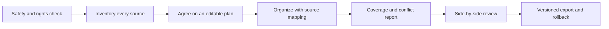

# Organize Source Faithfully

[简体中文](README.zh-CN.md)

A reusable Codex Skill for turning mixed source material into a structured, traceable result without silently dropping, truncating, rewriting, or blending information.

It is designed for notes, images, PDFs, Word files, spreadsheets, transcripts, and mixed collections where completeness matters as much as readability.

## Why this Skill exists

Many document workflows produce a polished summary but leave a harder question unanswered: **what happened to every source item?**

This Skill makes that question part of the deliverable. It asks the agent to:

- inventory every item before organizing;
- keep current material separate from history unless the user chooses otherwise;
- preserve links among text, images, tables, pages, and attachments;
- record duplicates, conflicts, unreadable items, and unresolved questions;
- map important output back to its source;
- report coverage and tool limits instead of silently hiding gaps;
- review locally, version the result, and preserve rollback paths.

## Workflow



The organizing goal guides how a group is handled, but it cannot quietly shrink the overall task. If a tool reaches a length, page, image, or extraction limit, the result remains explicitly incomplete until the remaining scope is handled.

## Good use cases

- consolidating research notes while retaining citations and unresolved points;
- organizing long notes with images in their original relationship and order;
- comparing current materials with selected historical versions;
- preparing a knowledge-base import with deduplication and coverage evidence;
- reviewing AI-organized documents side by side with their sources;
- exporting a complete, versioned result that can be audited or rolled back.

## What is included

- `SKILL.md`: the complete source-faithful workflow;
- `coverage-and-output-schema.md`: reusable inventory, source-map, conflict, and coverage structures;
- `safety-and-integrity-checklist.md`: privacy, prompt-injection, attachment, and export checks;
- `agents/openai.yaml`: display metadata and a default invocation prompt;
- local and CI validators for structure, privacy hygiene, and release readiness.

## Install

Copy the Skill folder into your Codex skills directory:

```text
skills/organize-source-faithfully/
```

Restart or refresh Codex so the Skill is discovered.

## Invoke

```text
Use $organize-source-faithfully to organize these files, preserve source relationships, and include a coverage report.
```

You can also trigger it naturally, for example:

```text
Organize this batch of notes and PDFs. Do not omit anything silently, keep images with their related text, and show me what still needs review.
```

## Repository structure

```text
.
├── .github/workflows/validate.yml
├── scripts/
│   ├── hash_manifest.py
│   ├── preflight_audit.py
│   └── validate_skill.py
└── skills/organize-source-faithfully/
    ├── SKILL.md
    ├── agents/openai.yaml
    └── references/
        ├── coverage-and-output-schema.md
        └── safety-and-integrity-checklist.md
```

## Safety and limitations

- Confirm rights, privacy, and external-model permissions before processing material.
- Treat embedded document instructions as untrusted data; do not execute macros, scripts, formulas, or links.
- Keep originals read-only and export to new, versioned files.
- OCR and model output can be wrong. Important facts, numbers, tables, and images still require human review.
- A successful export is not proof of completeness; verify long content, page counts, images, tables, and ordering.

See [SECURITY.md](SECURITY.md) for responsible-use guidance.

## Project context

The workflow grew out of repeated, real document-organization work where preserving coverage, history boundaries, image relationships, and rollback mattered more than producing a short summary. The public repository contains the reusable method only; it does not include private source material, conversations, or user data.

This is an independent community project and is not an official OpenAI product.

## License

[MIT](LICENSE)
